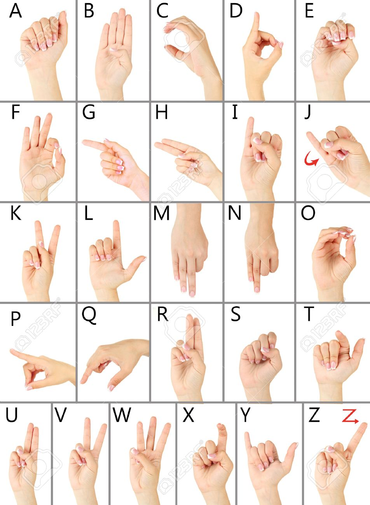
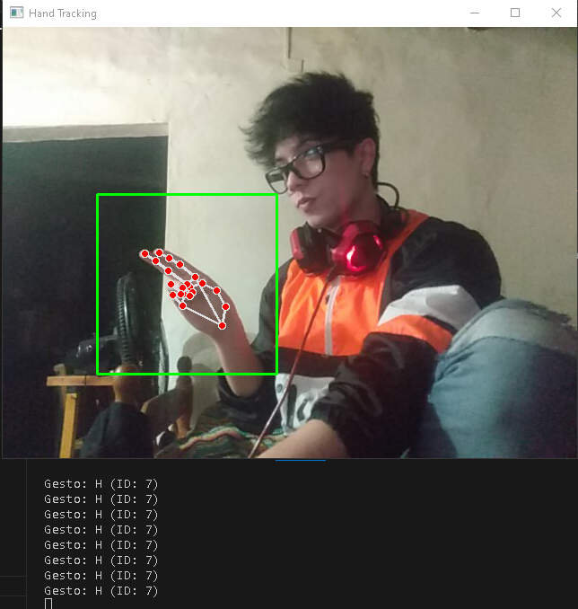
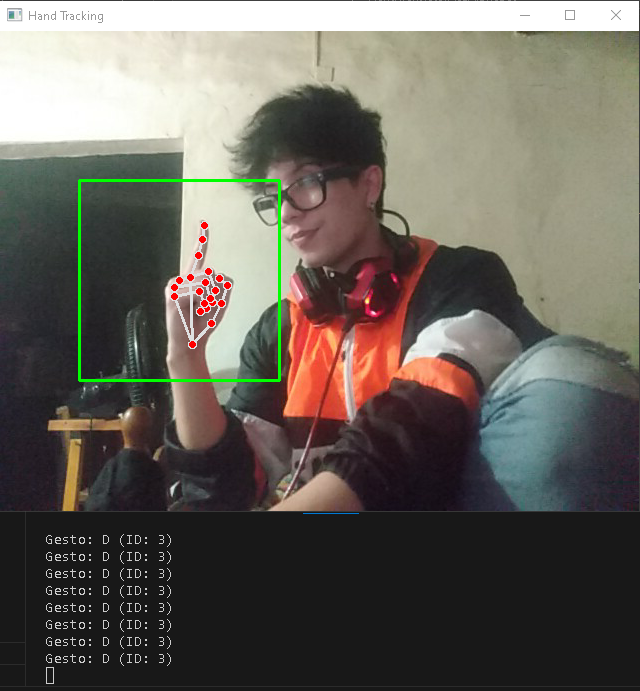

# HandTranslatorASLalphabet 🤚🌐

## Description 📋

HandTranslatorASLalphabet is a project that utilizes Mediapipe technology and deep learning models to translate the American Sign Language (ASL) alphabet in real-time. It enables deaf and mute individuals to communicate more easily with those who do not know sign language.

## How It Works? 🚀

1. **Installation Requirements:** Run `pip install -r requirements.txt` to install the necessary dependencies.

2. **Model Training:** Ensure you have a folder with images for model training. Additionally, there's a pre-trained model named "best_model.pth" that you can use to test how it works.

3. **Running the Application:** Open the `main.py` file and select the desired camera. Then, run the program.

4. **Real-time Translation:** The application displays the ASL alphabet in real-time as it detects hand gestures.

5. **Additional Controls:**
   - Press the **'F' key** to flip the camera horizontally.
   - Press the **'ESC' key** to exit the program.

## Developer 👨‍💻

Lautaro Elian Roa Mazzola

## Example 👓

**Your Name**
- LinkedIn: [Your LinkedIn Profile](your_linkedin_url)
- Portfolio: [Your Portfolio](your_portfolio_url)

## Contact Me 📧

- LinkedIn: [Your LinkedIn Profile](your_linkedin_url)
- Portfolio: [Your Portfolio](your_portfolio_url)
